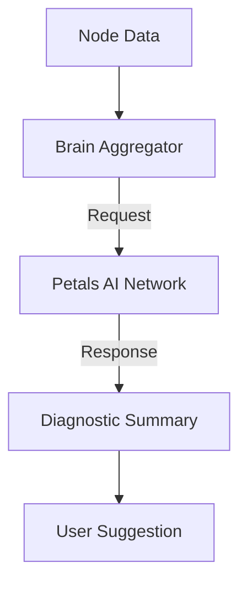

# ⬡ Polygone-Brain

**Network Intelligence & Autonomous Diagnostic Assistant.**

Polygone-Brain is the orchestration and intelligence layer of the Polygone network. It monitors swarm health, suggests topology optimizations, and provides a natural language interface for managing your post-quantum nodes.

## 🚀 Key Features

- **Polygone Doctor**: Runs automated health checks on all your repositories and active node connections.
- **AI Diagnostics**: Uses distributed inference (via `Polygone-Petals`) to identify network bottlenecks.
- **Vapor Intelligence**: Learns from ephemeral drift patterns to improve shard discovery speeds.

## 🛠️ Usage

### Run a full health diagnostic
```bash
polygone-brain doctor
```

### Ask the network brain
```bash
polygone-brain ask "How many relays are currently available for streaming?"
```

## 🏗️ Architecture



## ⚖️ License
MIT License - 2026 Lévy / Polygone Ecosystem.
